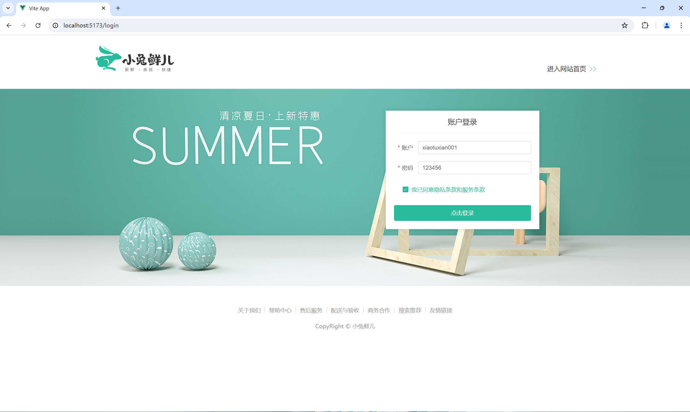
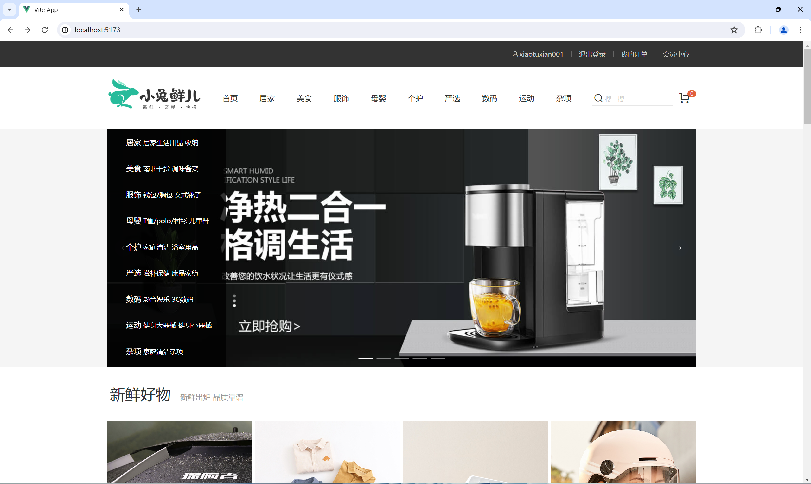
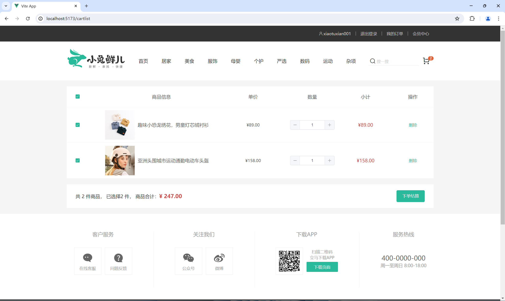
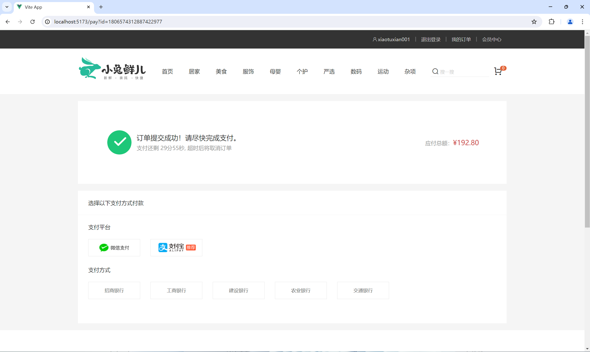

## vue-rabbit
小兔鲜儿电商项目（vue3全家桶）


## 技术栈
Vue3全家桶：create-vue、Pinia、ElementPlus、Vue3+Setup、Vue-Router、VueUse

## 项目截图
<div>
  
</div>

<div>
  
</div>

<div>
  
</div>

<div>
  
</div>

## Project Setup

```sh
npm install
```

### Compile and Hot-Reload for Development

```sh
npm run dev
```

### Compile and Minify for Production

```sh
npm run build
```

### Lint with [ESLint](https://eslint.org/)

```sh
npm run lint
```
